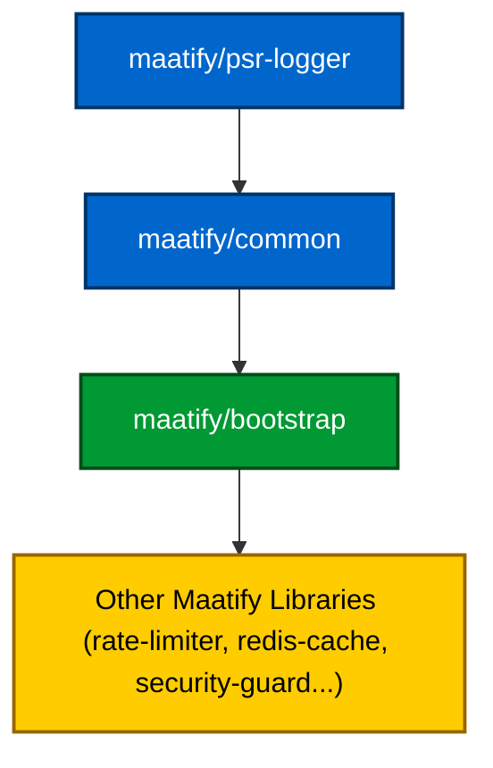

---

# ⚙️ Maatify Bootstrap

[](https://packagist.org/packages/maatify/bootstrap)
[](https://packagist.org/packages/maatify/bootstrap)
[](https://github.com/Maatify/bootstrap/actions/workflows/test.yml)

[](https://packagist.org/packages/maatify/bootstrap)
[](https://packagist.org/packages/maatify/bootstrap)

[](https://github.com/Maatify/bootstrap/stargazers)
[](LICENSE)
[]()
[](https://www.codefactor.io/repository/github/Maatify/bootstrap)

[](CHANGELOG.md)
[](SECURITY.md)

---

### طبقة تهيئة موحّدة للبيئة وتشخيص الأنظمة
**المشروع:** `maatify:bootstrap`
**الإصدار:** 1.0.3
**الترخيص:** MIT
**المطوّر:** [Mohamed Abdulalim (megyptm)](mailto:mohamed@maatify.dev)
**© 2025 Maatify.dev**

> 🔗 [English Version 🇬🇧](./README.md)

---

## 🧭 نظرة عامة

مكتبة `maatify/bootstrap` هي **الأساس المركزي** لنظام Maatify بالكامل،
حيث توفّر تهيئة موحّدة للبيئة (Environment Initialization) وتشخيصات دقيقة (Diagnostics)
إضافة إلى ضبط المنطقة الزمنية (Timezone) وفحص أمان التشغيل قبل البدء في تنفيذ أي تطبيق أو مكتبة ضمن منظومة Maatify.

تهدف إلى ضمان تشغيل مستقر ومتوقّع وآمن عبر جميع البيئات:
- بيئة التطوير المحليّة
- أنظمة الاختبار والتكامل المستمر (CI/CD)
- بيئات الإنتاج والاستضافة الفعلية

---

## ⚙️ التثبيت

```bash
composer require maatify/bootstrap
````

---

## 📦 الاعتمادات

تعتمد هذه المكتبة على مجموعة من المشاريع مفتوحة المصدر:

| الاعتماد             | الوظيفة الأساسية                                   | الرابط                                                             |
|----------------------|----------------------------------------------------|--------------------------------------------------------------------|
| **vlucas/phpdotenv** | تحميل ملفات البيئة `.env` بشكل آمن ومنظّم          | [github.com/vlucas/phpdotenv](https://github.com/vlucas/phpdotenv) |
| **psr/log**          | واجهة تسجيل قياسية (PSR-3 Logger Interface)        | [www.php-fig.org/psr/psr-3](https://www.php-fig.org/psr/psr-3/)    |
| **phpunit/phpunit**  | إطار عمل لاختبارات الوحدة (Unit Testing Framework) | [phpunit.de](https://phpunit.de)                                   |

> تبني `maatify/bootstrap` هذه المكتبات لتوفير طبقة تهيئة آمنة وموثوقة وموحّدة
> تُستخدم في جميع مكتبات وتطبيقات Maatify.

---

### 🧩 التسلسل الهرمي للاعتماد الداخلي (Internal Dependency Hierarchy)

تعتمد مكتبة **`maatify/bootstrap`** على تسلسل هرمي من المكونات الأساسية داخل منظومة Maatify،
مما يضمن تحميل جميع الطبقات الضرورية تلقائيًا بدون تكرار أو تعارض في الإصدارات.

| المستوى | المكتبة                   | الوظيفة                                                                        | يتم تحميلها تلقائيًا           |
|---------|---------------------------|--------------------------------------------------------------------------------|--------------------------------|
| 🧱 1    | **maatify/psr-logger**    | توفر نظام تسجيل متوافق مع معيار PSR-3 لتوحيد سجلات النظام.                     | ✅ نعم                          |
| 🧩 2    | **maatify/common**        | تحتوي على أدوات المساعدة الأساسية مثل المسارات، وإدارة البيئة، وتنظيف النصوص.  | ✅ يتم تضمينها عبر `psr-logger` |
| ⚙️ 3    | **maatify/bootstrap**     | تقوم بتهيئة البيئة والتحقق من الإعدادات وتشغيل النظام بشكل آمن.                | —                              |
| 🧠 4    | **مكتبات Maatify الأخرى** | مثل `maatify/rate-limiter` و `maatify/redis-cache` و `maatify/security-guard`. | تعتمد فقط على `bootstrap`      |

> 🧩 **ملاحظة:**
> تثبيت مكتبة `maatify/bootstrap` يؤدي تلقائيًا إلى تثبيت
> مكتبات `maatify/common` و `maatify/psr-logger`.
> لا حاجة لتضمينها يدويًا في أي مشروع، إذ يتم تحميلها عبر إدارة الاعتمادات في Composer.

---

#### 📦 مخطط تسلسل الاعتماد (Dependency Chain Diagram)



> يوضح هذا المخطط كيف تعتمد جميع مكتبات Maatify على نفس النواة الأساسية
> لضمان التهيئة الموحدة وتسجيل الأخطاء بطريقة متناسقة في جميع المشاريع.

---

### 🧩 جدول توافق الإصدارات (Version Compatibility Matrix)

| المكتبة                  |   PHP 8.2   | PHP 8.3 | PHP 8.4 | دعم CI |
|--------------------------|:-----------:|:-------:|:-------:|:------:|
| **maatify/psr-logger**   |   ⚠️ جزئي   | ✅ كامل  | ✅ كامل  |   ✅    |
| **maatify/common**       |   ⚠️ جزئي   | ✅ كامل  | ✅ كامل  |   ✅    |
| **maatify/bootstrap**    |   ⚠️ جزئي   | ✅ كامل  | ✅ كامل  |   ✅    |
| **maatify/rate-limiter** | ❌ غير مدعوم | ✅ كامل  | ✅ كامل  |   ✅    |
| **maatify/redis-cache**  | ❌ غير مدعوم | ✅ كامل  | ✅ كامل  |   ✅    |

> ⚙️ **ملاحظات:**
>
> * الاختبارات الرسمية وعمليات الـ CI موجهة إلى **PHP 8.3** و **PHP 8.4** فقط.
> * التوافق مع **PHP 8.2** محدود وغير مضمون.
> * جميع مكتبات Maatify الأساسية تتبع إصدارًا متزامنًا لضمان التكامل الكامل بينها.

---


## 🧩 المزايا الرئيسية

* 🔐 تحميل ملفات البيئة `.env` حسب الأولوية
* 🌍 إعداد المنطقة الزمنية (`APP_TIMEZONE` – الافتراضي: `Africa/Cairo`)
* 🧠 تخزين ذكي لقيم البيئة عبر `EnvHelper`
* 🧱 نقطة بدء موحّدة للتطبيقات باستخدام `Bootstrap::init()`
* 🚦 تفعيل "الوضع الآمن" (Safe Mode) لحماية بيئة الإنتاج
* 🧪 تغطية كاملة بالاختبارات الآلية (PHPUnit + CI)
* 🐳 جاهزة للتكامل مع Docker و GitHub Actions

---

## 🧠 أولوية تحميل ملفات البيئة

يقوم `maatify/bootstrap` بتحميل **ملف واحد فقط** من ملفات البيئة، حسب الترتيب التالي:

| الأولوية | الملف          | الاستخدام                          |
|----------|----------------|------------------------------------|
| 1️⃣      | `.env.local`   | إعدادات خاصة بالمطور (محلية وخاصة) |
| 2️⃣      | `.env.testing` | إعدادات بيئة الاختبار أو CI        |
| 3️⃣      | `.env`         | الإعدادات الأساسية لبيئة الإنتاج   |
| 4️⃣      | `.env.example` | ملف افتراضي يُستخدم كنسخة توضيحية  |

> بمجرد العثور على ملف بيئة صالح، **يتوقف التحميل مباشرة**
> لمنع أي ملف لاحق من استبدال القيم.
> وتُستخدم طريقة `Dotenv::createImmutable()` (من مكتبة **vlucas/phpdotenv**) لتأمين القيم ومنع التعديل عليها.

---

## 🧠 مثال على الاستخدام

```php
use Maatify\Bootstrap\Core\Bootstrap;

Bootstrap::init();

// الوصول إلى القيم المحمّلة من البيئة
$env = $_ENV['APP_ENV'] ?? 'production';
echo "يتم التشغيل في بيئة: $env";
```

ولتشغيل وضع التشخيص:

```php
use Maatify\Bootstrap\Core\BootstrapDiagnostics;
use Maatify\PsrLogger\LoggerFactory;

$logger = LoggerFactory::create('bootstrap');
$diag = new BootstrapDiagnostics($logger);

print_r($diag->run());
```

---

## 🧰 التكامل مع Docker

لتوحيد البيئة بين التطوير وبيئة الاختبار (CI):

```bash
docker compose up --build
docker compose exec bootstrap composer run-script test
```

---

## 🧪 الاختبارات

لتشغيل الاختبارات محليًا:

```bash
composer run-script test
```

يتم تنفيذ الاختبارات تلقائيًا في نظام GitHub Actions من خلال:

```
.github/workflows/tests.yml
```

---

## 📄 التوثيق الكامل

التوثيق المفصّل لكل مراحل التطوير (من المرحلة 1 إلى 7):
👉 [**docs/README.full.md**](./docs/README.full.md)

---

**Maatify Bootstrap** — *«تهيئة واحدة، واستقرار في كل مكان».*

---

## 🪪 الترخيص

**[ترخيص MIT](LICENSE)** © [Maatify.dev](https://www.maatify.dev)
يمكنك استخدام هذه المكتبة وتعديلها وتوزيعها بحرّية مع الحفاظ على النسبة إلى المصدر.

---

## 📚 المشاريع المعتمدة عليها

تم بناء `maatify/bootstrap` بالاعتماد على مشاريع مفتوحة المصدر أساسية:

| المكتبة                                                     | الوصف                                  | الاستخدام داخل المشروع                                                       |
|-------------------------------------------------------------|----------------------------------------|------------------------------------------------------------------------------|
| **[vlucas/phpdotenv](https://github.com/vlucas/phpdotenv)** | مكتبة شهيرة لتحميل ملفات البيئة `.env` | تستخدم لتحميل القيم بشكل آمن وغير قابل للتعديل في جميع مشاريع Maatify.       |
| **[psr/log](https://www.php-fig.org/psr/psr-3/)**           | واجهة تسجيل موحّدة من PHP-FIG (PSR-3)  | تُستخدم لتمكين نظام تسجيل متوافق وقابل للاستبدال ضمن `BootstrapDiagnostics`. |
| **[phpunit/phpunit](https://phpunit.de)**                   | إطار عمل للاختبارات في PHP             | يُستخدم لتشغيل جميع الاختبارات الآلية وضمان استقرار الحزم.                   |

> شكر خاص لمطوري هذه المشاريع مفتوحة المصدر
> لتقديمهم اللبنات الأساسية التي بُني عليها هذا المشروع ❤️

---

## 🧱 المطوّرون وحقوق النشر

**تم التطوير بواسطة:** [**Maatify.dev**](https://www.maatify.dev)
**المسؤول:** Mohamed Abdulalim
**المشروع:** `maatify:bootstrap`

---
