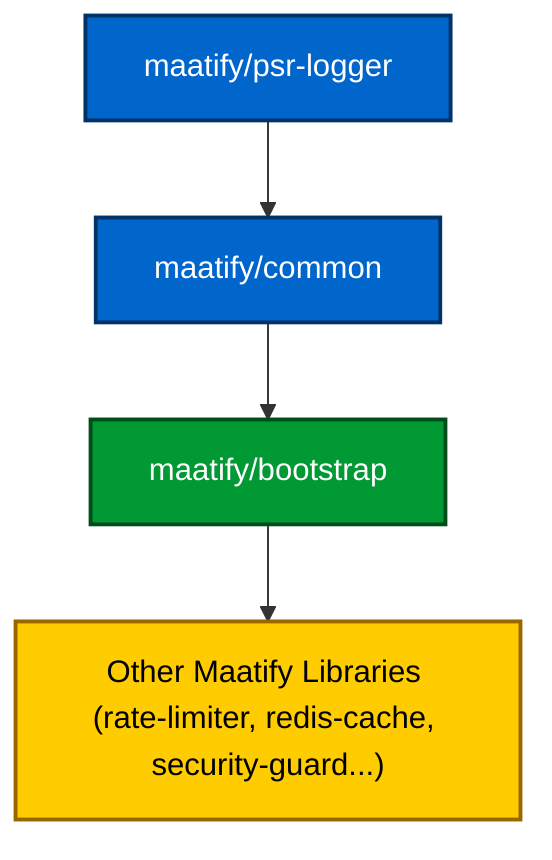

---

# ⚙️ Maatify Bootstrap

[](https://packagist.org/packages/maatify/bootstrap)
[](https://packagist.org/packages/maatify/bootstrap)
[](https://github.com/Maatify/bootstrap/actions/workflows/test.yml)

[](https://packagist.org/packages/maatify/bootstrap)
[](https://packagist.org/packages/maatify/bootstrap)

[](https://github.com/Maatify/bootstrap/stargazers)
[](LICENSE)
[]()
[](https://www.codefactor.io/repository/github/Maatify/bootstrap)

[](CHANGELOG.md)
[](SECURITY.md)

---

### Unified Environment Initialization & Diagnostics Layer
**Project:** `maatify:bootstrap`
**Version:** 1.0.3
**License:** MIT
**Author:** [Mohamed Abdulalim (megyptm)](mailto:mohamed@maatify.dev)
**© 2025 Maatify.dev**

> 🔗 [بالعربي 🇸🇦 ](./README-AR.md)

---

## 🧭 Overview

`maatify/bootstrap` is the **core foundation** for the entire Maatify ecosystem —
providing standardized environment initialization, diagnostics, timezone setup, and safe startup checks
for every Maatify PHP library and application.

It ensures consistent, predictable, and secure runtime behavior across:
- Local development
- CI/CD pipelines
- Staging and production environments

---

## ⚙️ Installation

```bash
composer require maatify/bootstrap
````

---

## 📦 Dependencies

This library relies on:

| Dependency           | Purpose                                           | Link                                                               |
|----------------------|---------------------------------------------------|--------------------------------------------------------------------|
| **vlucas/phpdotenv** | Secure `.env` file loader and environment manager | [github.com/vlucas/phpdotenv](https://github.com/vlucas/phpdotenv) |
| **psr/log**          | PSR-3 compatible logging interface                | [www.php-fig.org/psr/psr-3](https://www.php-fig.org/psr/psr-3/)    |
| **phpunit/phpunit**  | Unit testing framework (development only)         | [phpunit.de](https://phpunit.de)                                   |

> `maatify/bootstrap` builds upon these open-source libraries to provide a unified and secure initialization layer
> across the entire Maatify ecosystem.

---

### 🧩 Internal Dependency Hierarchy

`maatify/bootstrap` follows a **hierarchical dependency chain** within the Maatify ecosystem, ensuring that all foundational layers are automatically included — without redundancy or version conflicts.

| Layer | Library                     | Purpose                                                                            | Auto-Loaded                     |
|-------|-----------------------------|------------------------------------------------------------------------------------|---------------------------------|
| 🧱 1  | **maatify/psr-logger**      | Provides PSR-3 compliant logging for consistent system-wide logging.               | ✅ Included                      |
| 🧩 2  | **maatify/common**          | Core utilities and helpers (paths, environment helpers, string sanitization, etc.) | ✅ Included through `psr-logger` |
| ⚙️ 3  | **maatify/bootstrap**       | Initializes and validates environment setup and runtime behavior.                  | —                               |
| 🧠 4  | **Other Maatify Libraries** | e.g. `maatify/rate-limiter`, `maatify/redis-cache`, `maatify/security-guard`       | Depend only on `bootstrap`      |

> 🧩 **Note:**
> Installing `maatify/bootstrap` **automatically includes**
> both `maatify/common` and `maatify/psr-logger`.
> You do **not** need to manually require them — they are resolved internally via Composer dependencies.

---

#### 📦 Dependency Chain Diagram



> This diagram shows how each Maatify package inherits initialization and logging automatically
> through the unified bootstrap layer — ensuring consistent configuration and predictable startup behavior.

---

### 🧩 Version Compatibility Matrix

| Library                  |  PHP 8.2   | PHP 8.3 | PHP 8.4 | CI Support |
|--------------------------|:----------:|:-------:|:-------:|:----------:|
| **maatify/psr-logger**   | ⚠️ Partial | ✅ Full  | ✅ Full  |     ✅      |
| **maatify/common**       | ⚠️ Partial | ✅ Full  | ✅ Full  |     ✅      |
| **maatify/bootstrap**    | ⚠️ Partial | ✅ Full  | ✅ Full  |     ✅      |
| **maatify/rate-limiter** |     ❌      | ✅ Full  | ✅ Full  |     ✅      |
| **maatify/redis-cache**  |     ❌      | ✅ Full  | ✅ Full  |     ✅      |

> ⚙️ **Notes:**
>
> * Official testing and CI pipelines target **PHP 8.3** and **8.4**.
> * Backward compatibility with PHP 8.2 is limited and not guaranteed.
> * All Maatify core packages maintain synchronized versioning and consistent dependency alignment.

---

## 🧩 Features

* 🔐 Unified `.env` file loader with priority-based detection
* 🌍 Timezone configuration (`APP_TIMEZONE` → default `Africa/Cairo`)
* 🧠 Smart environment caching via `EnvHelper`
* 🧱 Cross-library bootstrap via `Bootstrap::init()`
* 🚦 Safe Mode activation for production protection
* 🧪 Full PHPUnit test coverage with CI integration
* 🐳 Docker & GitHub Actions ready

---

## 🧠 Environment Loading Priority

`maatify/bootstrap` loads only one `.env` file per execution — based on strict precedence:

| Priority | File           | Purpose                            |
|----------|----------------|------------------------------------|
| 1️⃣      | `.env.local`   | Developer/private overrides        |
| 2️⃣      | `.env.testing` | CI or PHPUnit configuration        |
| 3️⃣      | `.env`         | Main production configuration      |
| 4️⃣      | `.env.example` | Always-available fallback template |

> Once a file is found, loading **stops immediately** — ensuring lower-priority files cannot override higher ones.
> Uses `Dotenv::createImmutable()` (from **vlucas/phpdotenv**) for safety, preventing accidental overwrites.

---

## 🧠 Usage Example

```php
use Maatify\Bootstrap\Core\Bootstrap;

Bootstrap::init();

// Access loaded variables
$env = $_ENV['APP_ENV'] ?? 'production';
echo "Running in environment: $env";
```

or for diagnostic mode:

```php
use Maatify\Bootstrap\Core\BootstrapDiagnostics;
use Maatify\PsrLogger\LoggerFactory;

$logger = LoggerFactory::create('bootstrap');
$diag = new BootstrapDiagnostics($logger);

print_r($diag->run());
```

---

## 🧰 Docker Integration

For consistent environment parity between local and CI:

```bash
docker compose up --build
docker compose exec bootstrap composer run-script test
```

---

## 🧪 Testing

Run tests locally:

```bash
composer run-script test
```

CI is automatically triggered via GitHub Actions:

```
.github/workflows/tests.yml
```

---

## 📄 Documentation

Full technical documentation covering all phases (1 → 7):
👉 [**docs/README.full.md**](./docs/README.full.md)

---

**Maatify Bootstrap** — *“Initialize once, stabilize everywhere.”*

---

## 📚 Built Upon

`maatify/bootstrap` is proudly built upon and extends several foundational open-source projects:

| Library                                                     | Description                             | Usage in Project                                                                                |
|-------------------------------------------------------------|-----------------------------------------|-------------------------------------------------------------------------------------------------|
| **[vlucas/phpdotenv](https://github.com/vlucas/phpdotenv)** | Industry-standard `.env` loader for PHP | Provides immutable and secure environment loading across all Maatify projects.                  |
| **[psr/log](https://www.php-fig.org/psr/psr-3/)**           | PHP-FIG PSR-3 logging interface         | Enables standardized, interchangeable logging (used by `BootstrapDiagnostics` and PSR loggers). |
| **[phpunit/phpunit](https://phpunit.de)**                   | PHP unit testing framework              | Powers the complete automated test suite with CI/CD integration.                                |

> Special thanks to the maintainers of these open-source libraries
> for providing the stable foundations that make this project possible. ❤️

---

## 🪪 License

**[MIT license](LICENSE)** © [Maatify.dev](https://www.maatify.dev)
You’re free to use, modify, and distribute this library with attribution.

---

## 🧱 Authors & Credits

**Developed by:** [**Maatify.dev**](https://www.maatify.dev)
**Maintainer:** Mohamed Abdulalim
**Project:** `maatify:bootstrap`

---
