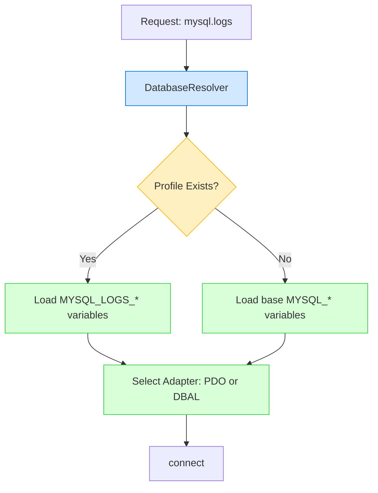

# 🧩 Multi-Profile MySQL Configuration
**Version:** 1.1.0
**Module:** maatify/data-adapters
**Feature:** Phase 10 – Scoped MySQL Profiles

---

## 📘 Overview

Starting from **v1.1.0**, `maatify/data-adapters` introduces **multi-profile MySQL connections**, allowing projects to define and use multiple independent MySQL databases within the same application.

Each profile (e.g., `main`, `logs`, `analytics`) has its own host, user, port, password, and database name — all loaded from environment variables.

This keeps the library:
- Flexible
- Scalable
- Fully environment-driven
- Backward compatible with legacy `MYSQL_*` variables

---

# 🎯 Why Multi-Profile?

Many real-world systems require **more than one MySQL database**, such as:

| Profile           | Use Case                                |
|-------------------|-----------------------------------------|
| `mysql.main`      | Main operational database               |
| `mysql.logs`      | Activity logs, tracking, analytics      |
| `mysql.auth`      | Security & credential storage           |
| `mysql.archive`   | Archived or partitioned historical data |
| `mysql.analytics` | BI / dashboard reporting                |

Before Phase 10 → developers used multiple “manual adapters”,
but now → **DatabaseResolver fully manages it**.

---

# ⚙️ Environment Structure

You may define any number of profiles using **prefixed environment variables**:

```

MYSQL_MAIN_HOST=
MYSQL_MAIN_PORT=
MYSQL_MAIN_USER=
MYSQL_MAIN_PASS=
MYSQL_MAIN_DB=

MYSQL_LOGS_HOST=
MYSQL_LOGS_DB=

MYSQL_ANALYTICS_HOST=
MYSQL_ANALYTICS_DB=

```

## ✔️ Naming Rules
The variable format is:

```

MYSQL_{PROFILE_UPPERCASE}_{FIELD}

```

Where:

| Field  | Meaning                   |
|--------|---------------------------|
| HOST   | MySQL host / IP           |
| PORT   | Port (default: 3306)      |
| USER   | Username                  |
| PASS   | Password                  |
| DB     | Database name             |
| DRIVER | "pdo" (default) or "dbal" |

Examples:

```

MYSQL_LOGS_HOST=127.0.0.1
MYSQL_LOGS_DB=maatify_logs
MYSQL_LOGS_DRIVER=dbal

```

---

# 🧠 Backward Compatibility

If a requested profile does **not** have prefixed variables, the resolver automatically falls back to:

```

MYSQL_HOST=
MYSQL_PORT=
MYSQL_USER=
MYSQL_PASS=
MYSQL_DB=
MYSQL_DRIVER=

````

Meaning → existing projects don’t break.

---

# 🧩 Example: Using Profiles in Code

```php
use Maatify\DataAdapters\Core\EnvironmentConfig;
use Maatify\DataAdapters\Core\DatabaseResolver;

$config   = new EnvironmentConfig(__DIR__);
$resolver = new DatabaseResolver($config);

// Connect to main database
$main = $resolver->resolve("mysql.main");
$main->connect();

// Connect to logs database
$logs = $resolver->resolve("mysql.logs");
$logs->connect();
````

Each one gets its own isolated adapter instance.

---

# 🧪 Testing

The adapter system includes tests verifying:

* Profile prefix resolution
* Fallback to legacy variables
* Separate DSN generation for each profile
* Adapter instance caching per profile

Test classes:

```
tests/
 ├─ MySQLProfileResolverTest.php
 ├─ EnvironmentFallbackTest.php
 └─ ProfileCachingTest.php
```

---

# 🌀 Internal Flow (How Resolution Works)



---

# 🧱 Design Guarantees

| Guarantee           | Description                              |
|---------------------|------------------------------------------|
| Scalable            | Unlimited number of profiles             |
| Fully deterministic | No runtime ambiguity                     |
| Zero side effects   | Each profile gets isolated configuration |
| Auto-detection      | DBAL/PDO selected per-profile            |
| Safe fallback       | Legacy applications keep working         |

---

# 📌 Recommended Folder Structure

(For large applications)

```
.env
docs/
   mysql-profiles.md
config/
   databases.example.php  (optional for future Phase 11)
```

---

# 🏁 Summary

The Multi-Profile MySQL feature gives developers a clean, elegant, and fully environment-driven way to manage multiple database connections using a single unified adapter system — with zero boilerplate and perfect backward compatibility.

This prepares the library for advanced use cases and improves maintainability across the entire **Maatify Ecosystem**.

---

**© 2025 Maatify.dev**
Engineered by **Mohamed Abdulalim ([@megyptm](https://github.com/megyptm))** — https://www.maatify.dev

📘 Full documentation & source code:
https://github.com/Maatify/data-adapters

---
